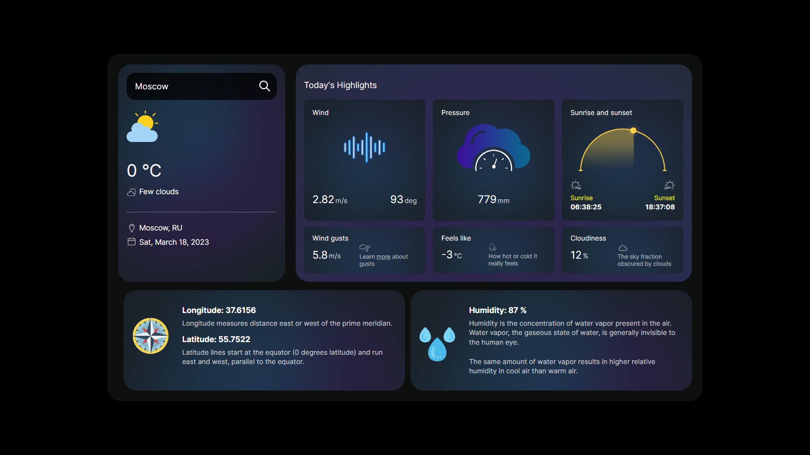

# Weather terminal

### Данный проект создан с целью обучения. 
### Проект представляет Обозреватель погоды. Пользователь вводит город и получает информацию о погоде в нём.

### **Author** - Junior Frontend Developer `Вячеслав Черногоров`.

---

## Технологии 

### Weather_terminal

- Vue js,
- Vite,
- Sass,
- Publick Api.

---

## Предпросмотр проекта

  

---
## Установка и запуск

Требования:

* npm >= 6.14;

### Запуск:

Для запуска на ваш компьютер нужно на локальном компьютере выполнить команду: 

- `git clone https://github.com/ChernoSlava/Weather_terminal.git` - Для копирования проекта на локальный пк по https;

После этого в консоли нужно выполнить: 

- `npm i` - Для установки зависимостей;

Для использования:

- `npm run dev` - Команда для запуска режима разработки;
- `npm run build` - Команда для сборки проекта;
- `npm run preview` - Команда для предпросмотра проекта;

---

## Ссылки на другие проекты
### Проекты созданные при обучении Яндекс.Практикум:

1) [Статичный сайт Путешествие по России](https://github.com/ChernoSlava/Russian-travel);
2) [Репозиторий проекта Место на чистом js](https://github.com/ChernoSlava/Mesto);
3) [Репозиторий полноценного доработанного проекта Место Frontend и Backend](https://github.com/ChernoSlava/react-mesto-api-full);
4) [Дипломный проект Movies explorer](https://github.com/ChernoSlava/movies-explorer-frontend).

### Проекты созданные при обучении и менторстве senior web developer Абретова А.:

1) [Counter](https://github.com/ChernoSlava/counter);
2) [Counter-temperature](https://github.com/ChernoSlava/counter-temperature);
3) [ToDo list](https://github.com/ChernoSlava/ToDo);
4) [Contacts keeper](https://github.com/ChernoSlava/contacts-keeper);
4) [Fish gallery](https://github.com/ChernoSlava/fish-gallery);
5) [Рефакторинг дипломного проекта Movies explorer](https://github.com/ChernoSlava/Movies-exlorer-refactor).

### Проекты с использованием разных технологий:

1) [Digitals clock с использование SCSS/jQuery](https://github.com/ChernoSlava/Digital-Clock.git);
2) [Films review с использование PUG/SCSS](https://github.com/ChernoSlava/Film-Review);
3) [2d игра на Vanila JavaScript/Canvas](https://github.com/ChernoSlava/Fluppy);
4) [Сайт по продаже бургеров React/Next js](https://github.com/ChernoSlava/Burgers-Next-JS);
5) [Сайт обозреватель погоды Weather_terminal с использованием SASS/Vue js](https://github.com/ChernoSlava/Weather_terminal)
